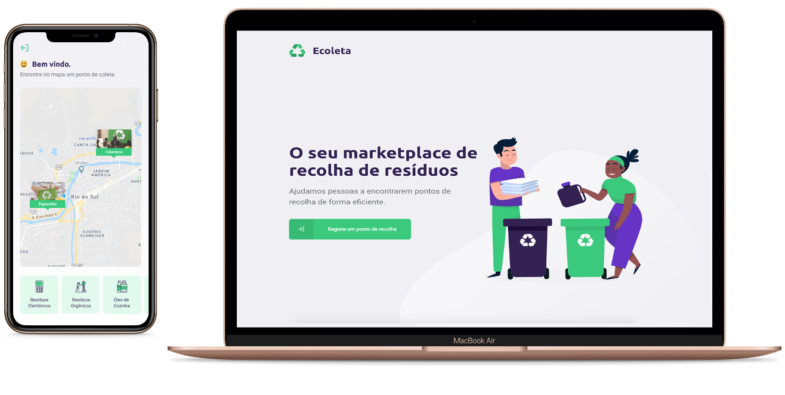

<h1 align="center">
  
</h1>

<h3 align="center">
  ♻ Ecoleta | Next Level Week - 1st Edition
</h3>

<p align="center">
  <a href="#%EF%B8%8F-about-the-project">About the project</a>&nbsp;&nbsp;&nbsp;|&nbsp;&nbsp;&nbsp;
  <a href="#-demo">Demo</a>&nbsp;&nbsp;&nbsp;|&nbsp;&nbsp;&nbsp;
  <a href="#-preview">Preview</a>&nbsp;&nbsp;&nbsp;|&nbsp;&nbsp;&nbsp;
  <a href="#-technologies">Technologies</a>&nbsp;&nbsp;&nbsp;|&nbsp;&nbsp;&nbsp;
  <a href="#-getting-started">Getting started</a>&nbsp;&nbsp;&nbsp;
</p>

</br>



## 💇🏻‍♂️ About the project

This application provide a flow to create recyclable collection points and showing them on maps and allowing you to search for points.
You can send a text message using whatsapp or email, to contact entities of collection points.

This project was developed on Next Level Week event by Rocketseat 🚀

---

## ⚙ Technologies

- **Back end**

  - NodeJS
  - Express
  - Typescript
  - Sqlite
  - multer
  - celebrate/Joi

- **Front end**

  - ReactJS
  - Typescript
  - react-router-dom
  - axios
  - leaflet
  - react-leaflet

- **Mobile**
  - React Native/Expo
  - Typescript
  - react-navigation
  - axios
  - react-native-picker-select
  - react-native-svg
  - react-native-maps
  - expo-font
  - expo-location
  - expo-mail-composer

---

## 📸 Demo


<br />


<br />

## 💻 Getting started

> Clone the repository

```bash
  # Clone repository
  git clone https://github.com/franciscovaz/recolhaECO.git
```

> Run server

```bash
  # Access server
  cd server

  # Create tables
  yarn run knex:migrate

  # Create seeds
  yarn run knex:seed

  # Run server
  yarn dev
```

> Run web project

```bash
  # Access web project
  cd nlw-web

  # Run web project
  yarn start
```

> Run mobile project
> You will need to download the Expo app. When the application starts, scan the qrcode with your mobile camera and open expo.

```bash
  # Access mobile project
  cd nlw-mobile

  # Change the IP in services/api.ts to connect with the back end
  cd services

  # Run
  yarn start
```

---
